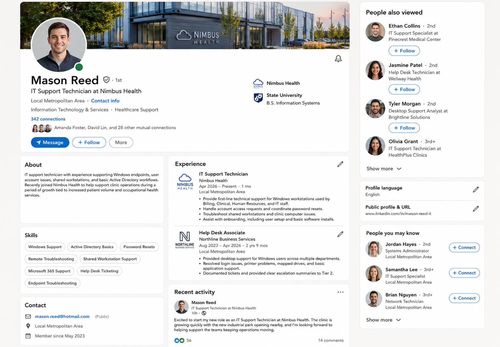
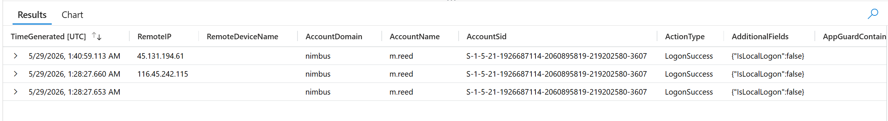
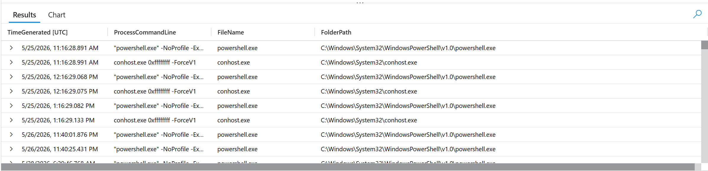
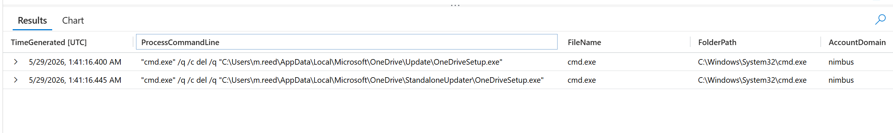
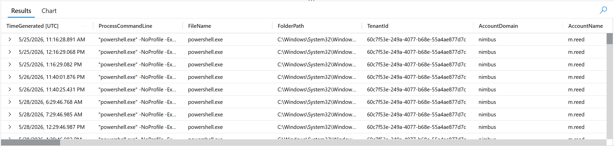
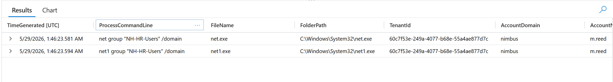
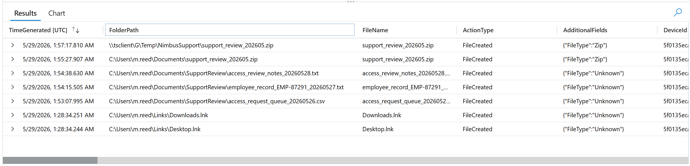
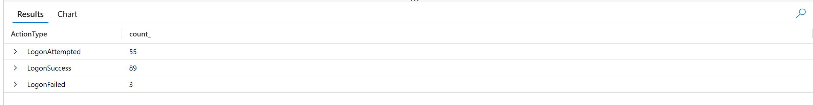
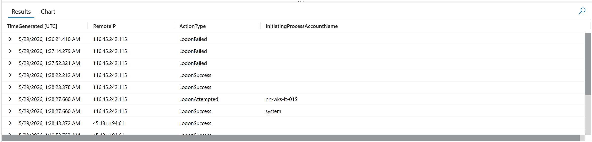
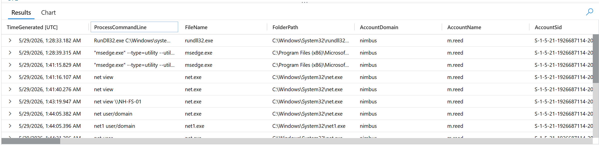

# Threat Hunt Report - Just Another Day, Part Two

**Case:** NH-INC-2026-0529 · Nimbus Health // Cyber Range SOC
**Platform:** Windows estate: billing, HR, clinical, IT
**Window:** 25-30 May 2026 (activity window), 29 May 2026 (incident date)


---

## 1. Complete Scenario

### ☠️ Short Summary

Nimbus Health grew fast. A nearby industrial park drove up patient volume, and billing, HR, and IT support all hired at once, onto shared workstations, with access review left for later. A routine credential exposure sweep flagged one of those new starters, an IT support technician whose identity and an old password were already sitting in public breach data. Days later, authentication telemetry on his workstation showed a short, targeted run of failed logons from a single external address, then a success. From there the operator ran a native orientation burst, sat through Windows' and OneDrive's own housekeeping noise, enumerated the file server and the HR group, and reached into an access-request file that belonged to HR, not IT. The material was staged locally, zipped, and pushed out through the RDP client's own mapped drive rather than any conventional upload. No persistence was left behind, and the file server itself was never touched directly, only reached through a share. Overall, this was **OSINT-enabled credential reuse, valid-account compromise, discovery, and cross-department collection**, again carried out entirely with living-off-the-land tooling and an already-open remote session.

---

**// REVIEW ASSIGNMENT // Nimbus Health**

> From: Hunt Lead // Cyber Range SOC
> To: Threat Hunt // On-Shift
> Re: Nimbus Health // credential exposure follow-up
>
> Nimbus Health again — the clinic from March. Rapid hiring after a nearby industrial park opened put new starters on shared workstations, access review deferred. A routine credential exposure sweep flagged one new hire: his identity and an old password are already public. Telemetry around the same period shows failed logons against his account, then a success.
>
> Work out: how the account was found and targeted · whether the credentials were used, and from where · what happened once someone was on the keyboard · what it reached outside its role, and where that went · what was left behind, and the honest root cause.
>
> Telemetry is in **law-cyber-range**, MDE tables: DeviceLogonEvents, DeviceProcessEvents, DeviceFileEvents, DeviceEvents. Start outside the SIEM — the earliest answers are in the OSINT artefacts, not the logs.
>
> **Bind every query to 25-30 May 2026 and `DeviceName startswith "nh-wks-it-01"`.** Shared workspace: don't drift into March (part one), and don't mistake background brute-force noise for your intruder.
>
> Section 00 is a gate. Confirm workspace, window, host filter, and acknowledge with **"Nimbus support review ready"** before you begin.
>
> // Hunt Lead, Cyber Range SOC · Nimbus Health series, part two

---

### Live Announcement

> 🔵 **HUNT 14 // ANOTHER DAY, PART TWO // LIVE**

> Nimbus Health is back on the board. Growth outpaced access review, and one new hire's identity was sitting in public long before anyone touched a keyboard. This time the first answers aren't in the SIEM at all.
>
> The box is under constant noise, thousands of failed logons from dozens of addresses, and almost none of it goes anywhere. Somewhere in that noise floor is one source that's patient, targeted, and eventually gets in.
>
> Filter, or drown. Shared workspace, May window, one host, one account. There's a later part one incident sitting in the same data if you drift out of the window.
>
> Difficulty: **Beginner**, with a harder edge
>
> Flags: **25** // gate + 6 phases

---

### How To Hunt This [method, not answers]

A beginner hunt with a harder edge: separating one deliberate intrusion from a very loud background, and proving your negatives instead of assuming them.

**01** Start outside the SIEM — identity and exposure before logs.

**02** Filter first: May window, single host, one account.

**03** Volume is not signal. Find the source that's patient, targeted, and succeeds.

**04** Mind your anchor — a session opening isn't a person starting work.

**05** Read strings off the log line, don't assume naming conventions.

**06** Check the role before calling it abuse.

**07** Follow the data out — not every exit is a network transfer.

**08** Prove the negatives, don't assume them.

---

## 2. Objectives

Work Nimbus Health's second incident end to end, starting outside the SIEM:

- Establish who the account belonged to and why an outsider would bother targeting him
- Identify the exposure that actually made an old password usable
- Separate the genuine intrusion attempt from constant background brute-force noise
- Reconstruct the operator's on-keyboard activity, telling machine housekeeping apart from hands-on-keyboard action
- Prove what the account reached outside its role, and where that material ended up
- Confirm or rule out persistence, and identify every host genuinely touched
- Deliver the honest, evidence-supported root cause and the incident-response follow-through

---

## 3. Tools & Technologies

| Tool / Technology | Role in the Hunt |
|---|---|
| Microsoft Sentinel | Central query surface: `law-cyber-range` workspace |
| Microsoft Defender for Endpoint (MDE) | Source telemetry for logon, process, and file events |
| KQL | Query language used across all MDE tables |
| DeviceLogonEvents | Authentication: logon type, source IP, remote sessions |
| DeviceProcessEvents | Process/command-line activity: recon, native tooling |
| DeviceFileEvents | File access, staging, and archive creation |
| OSINT artefacts | LinkedIn profile, Have I Been Pwned lookup, internal Security Operations Artifacts sheet |
| Windows estate | Billing, HR, clinical, and IT hosts (`nh-*`), scoped to `nh-wks-it-01` |

---

## 4. Flags

### 🚩 Flag 1: The Account Under Review

**What to find:** A routine credential exposure sweep surfaced one new hire whose details were already circulating publicly. Name the account.


| Field | Value |
|---|---|
| **Answer** | m.reed |
| **Time (UTC)** | N/A |

**Details:** The account under review is m.reed, a recently joined IT support desk employee identified in the Nimbus Health role matrix.

**Source:** [Nimbus_Health__Security_Operations_Artifacts_May_-_Sheet1.pdf](assets/OSINT/Nimbus_Health__Security_Operations_Artifacts_May_-_Sheet1.pdf)

---

### 🚩 Flag 2: His Public Role

**What to find:** Before touching a single log, work out what this man does for a living, straight from his own public profile. Give his listed job title.


| Field | Value |
|---|---|
| **Answer** | IT Support Technician |
| **Time (UTC)** | N/A |

**Details:** The public professional profile lists IT Support Technician as his job title.



---

### 🚩 Flag 3: The Personal Address

**What to find:** The same public profile lists a way to reach him outside of work. Give the address.


| Field | Value |
|---|---|
| **Answer** | mason.reed@hotmail.com |
| **Time (UTC)** | N/A |

**Details:** The public professional profile lists mason.reed@hotmail.com as the contact address.

**Source:** The LinkedIn profile picture above.

---

### 🚩 Flag 4: Which Breach Explains the Reuse

**What to find:** A lookup against his personal address turns up more than one historical exposure. Only one of them actually explains why an old password still worked. Name it, and say why it's the one that matters.


| Field | Value |
|---|---|
| **Answer** | Combolists Posted to Telegram — the data is usable because further data can be found on the dark market |
| **Time (UTC)** | N/A |

**Details:** The Combolists Posted to Telegram breach is the useful exposure because the associated data could lead to further credential information being obtained on the dark market.

**Source:** [mason_reed_haveibeenpwned.pdf](assets/OSINT/mason_reed_haveibeenpwned.pdf)

---

### 🚩 Flag 5: The Remote Support Endpoint

**What to find:** Somewhere in Nimbus's own internal documentation sits the address an outsider would need to actually reach this machine for remote support. Give it.


| Field | Value |
|---|---|
| **Answer** | 135.237.163.62 |
| **Time (UTC)** | N/A |

**Details:** The cached support reference identifies 135.237.163.62 as the public address an external attacker would target for remote support access.

**Source:** [Nimbus_Health__Security_Operations_Artifacts_May_-_Sheet1.pdf](assets/OSINT/Nimbus_Health__Security_Operations_Artifacts_May_-_Sheet1.pdf)

---

### 🚩 Flag 6: The Guessing Source

**What to find:** The workstation is under constant background noise from the open internet. Cut through it and find the one source that's patient, targeted, and eventually gets in.


| Field | Value |
|---|---|
| **Answer** | 116.45.242.115 |
| **Time (UTC)** | 2026-05-29T01:28:27.6602558Z |

**Details:** The low-volume source targeting m.reed and eventually succeeding was 116.45.242.115.

**Query:**
```kql
DeviceLogonEvents
| where TimeGenerated between (datetime(2026-05-25) .. datetime(2026-05-30))
| where ActionType == "LogonSuccess"
| where AccountName == "m.reed"
| where DeviceName startswith "nh-wks-it-01"
| where LogonType == "RemoteInteractive"
| project-reorder TimeGenerated, RemoteIP, RemoteDeviceName
```



---

### 🚩 Flag 7: How They Came In

**What to find:** That successful session isn't someone sitting at the desk. Give the logon type.


| Field | Value |
|---|---|
| **Answer** | RemoteInteractive |
| **Time (UTC)** | 2026-05-29T01:28:27.6602558Z |

**Details:** The successful logon for m.reed was a RemoteInteractive session, indicating the account was accessed remotely rather than in person.

**Query:** Same as Flag 6

---

### 🚩 Flag 8: The Second Source

**What to find:** The account doesn't stay on one address for the whole engagement. Give the second external source it's used from.


| Field | Value |
|---|---|
| **Answer** | 45.131.194.61 |
| **Time (UTC)** | 2026-05-29T01:40:59.1133741Z |

**Details:** The m.reed account was subsequently used from a second external source, 45.131.194.61.

**Query:** Same as Flag 6

---

### 🚩 Flag 9: Getting Their Bearings

**What to find:** Once the session opens, there's a stretch of platform noise before real hands-on-keyboard activity starts. Lay out the sequence, in order, and be able to tell the operator's own orientation commands apart from Windows' own housekeeping.


| Field | Value |
|---|---|
| **Answer** | whoami, hostname, "backgroundTaskHost.exe" -ServerName:App.AppXmtcan0h2tfbfy7k9kn8hbxb6dmzz1zh0.mca, RuntimeBroker.exe -Embedding, DllHost.exe /Processid:{AB8902B4-09CA-4BB6-B78D-A8F59079A8D5}, ipconfig /all, whoami /groups |
| **Time (UTC)** | 2026-05-29T01:30:14.83502Z |

**Details:** After the remote session opened, the operator's command burst began with whoami and hostname, followed by Windows/Edge first-run housekeeping activity, then ipconfig /all and whoami /groups to establish host and account context.

**Query:**
```kql
DeviceProcessEvents
| where TimeGenerated between (datetime(2026-05-25) .. datetime(2026-05-30))
| where AccountName == "m.reed"
| where DeviceName startswith "nh-wks-it-01"
| project TimeGenerated, ProcessCommandLine, FileName, FolderPath
| order by TimeGenerated asc
| where not(FileName has_any ("msedge.exe", "background", "setup", "dll", "Sync"))
```



---

### 🚩 Flag 10: Signal or Noise

**What to find:** Sort by time and a deletion jumps out early. Work out whether that's the operator covering tracks, or something else entirely, and say what actually triggered it.


| Field | Value |
|---|---|
| **Answer** | It is not the actor; explorer.exe is triggering cmd.exe to delete OneDrive's OneDriveSetup.exe updater files |
| **Time (UTC)** | 2026-05-29T01:41:16.4000248Z |

**Details:** The deletion was not operator activity. explorer.exe triggered cmd.exe to delete OneDrive's OneDriveSetup.exe updater files, identifying the deletion as machine/application housekeeping rather than the actor.

**Query:**
```kql
DeviceProcessEvents
| where TimeGenerated between (datetime(2026-05-25) .. datetime(2026-05-30))
| where AccountName == "m.reed"
| where DeviceName startswith "nh-wks-it-01"
| where ProcessCommandLine contains "del"
| project-reorder TimeGenerated, ProcessCommandLine, FileName, FolderPath, *
| order by TimeGenerated asc
```



---

### 🚩 Flag 11: Looking at the File Server

**What to find:** Past the noise, the operator checks what one particular server has to offer. Give the exact command.


| Field | Value |
|---|---|
| **Answer** | net view \\NH-FS-01 |
| **Time (UTC)** | 2026-05-29T01:43:19.9477383Z |

**Details:** The operator used net view \\NH-FS-01 to query the file server and enumerate what it was sharing.

**Query:**
```kql
DeviceProcessEvents
| where TimeGenerated between (datetime(2026-05-25) .. datetime(2026-05-30))
| where AccountName == "m.reed"
| where DeviceName startswith "nh-wks-it-01"
| where ProcessCommandLine !contains "msedge"
| where ProcessCommandLine !contains "con"
| where ProcessCommandLine !contains "DLL"
| where ProcessCommandLine !contains "task"
| where ProcessCommandLine !contains "Protocol"
| where ProcessCommandLine !contains "-Embedding"
| project-reorder TimeGenerated, ProcessCommandLine, FileName, FolderPath, *
| order by TimeGenerated asc
```



---

### 🚩 Flag 12: Who Is In HR

**What to find:** An IT support account has no obvious reason to care who's in HR. It asks anyway. Give the exact command it ran to find out.


| Field | Value |
|---|---|
| **Answer** | net group "NH-HR-Users" /domain |
| **Time (UTC)** | 2026-05-29T01:46:23.5812731Z |

**Details:** The IT support account enumerated the HR group using the exact command net group "NH-HR-Users" /domain.

**Query:**
```kql
DeviceProcessEvents
| where TimeGenerated between (datetime(2026-05-25) .. datetime(2026-05-30))
| where AccountName == "m.reed"
| where DeviceName startswith "nh-wks-it-01"
| where ProcessCommandLine contains "-HR"
| project-reorder TimeGenerated, ProcessCommandLine, FileName, FolderPath, *
| order by TimeGenerated asc
```



---

### 🚩 Flag 13: Crossing the Line

**What to find:** The account reaches into a file that belongs to a department it doesn't support. Name the real file it opened, not the shortcut Windows leaves behind, the file itself.


| Field | Value |
|---|---|
| **Answer** | access_request_queue_20260526.csv |
| **Time (UTC)** | 2026-05-29T01:53:07.9959461Z |

**Details:** The IT support account accessed access_request_queue_20260526.csv, a file belonging to another department outside the IT share. The matching real file was identified rather than the earlier .lnk shortcut artifact created by Windows.

**Query:**
```kql
DeviceFileEvents
| where TimeGenerated between (datetime(2026-05-25) .. datetime(2026-05-30))
| where RequestAccountName == "m.reed"
| where DeviceName == "nh-wks-it-01.corp.nimbushealth.com"
| project-reorder TimeGenerated, FolderPath, FileName, ActionType, *
| where FolderPath !startswith "C:\\Users\\m.reed\\AppData"
```



---

### 🚩 Flag 14: Where They Put It

**What to find:** Before anything moved anywhere, it landed in a local staging folder. Give the path.


| Field | Value |
|---|---|
| **Answer** | C:\Users\m.reed\Documents\SupportReview |
| **Time (UTC)** | 2026-05-29T01:53:07.9959461Z |

**Details:** The operator staged the collected material locally in C:\Users\m.reed\Documents\SupportReview before moving it.

**Query:** Same as Flag 13

---

### 🚩 Flag 15: The Archive

**What to find:** The staged material gets packaged before it leaves. Name the archive.


| Field | Value |
|---|---|
| **Answer** | support_review_202605.zip |
| **Time (UTC)** | 2026-05-29T01:55:27.9077327Z |

**Details:** The staged material was compressed into the archive support_review_202605.zip.

**Query:** Same as Flag 13

---

### 🚩 Flag 16: How It Left

**What to find:** This didn't go out over a cloud upload or a conventional network transfer. It left through a channel that was already open. Name the path it went through.


| Field | Value |
|---|---|
| **Answer** | \\tsclient\G\Temp\NimbusSupport |
| **Time (UTC)** | 2026-05-29T01:57:17.8107171Z |

**Details:** The archive was written to \\tsclient\G\Temp\NimbusSupport through the existing remote session rather than being uploaded to a cloud service or transferred through a conventional network channel.

**Query:** Same as Flag 13

---

### 🚩 Flag 17: What They Left Behind

**What to find:** Check whether the operator planted anything to survive a reboot or a logoff. Prove the negative, don't assume it.


| Field | Value |
|---|---|
| **Answer** | No persistence was established by the operator; the scheduled tasks, services, and autoruns found belong to the platform |
| **Time (UTC)** | N/A |

**Source:** DeviceProcessEvents, DeviceRegistryEvents

---

### 🚩 Flag 18: Where They Actually Sat

**What to find:** The file server was named in recon. Work out whether the operator ever actually ran anything there, or only ever reached it a different way.

| Field | Value |
|---|---|
| **Answer** | No, the account never ran anything on the file server; the material was reached through a shared folder |
| **Time (UTC)** | N/A |

**Source:** Flags 12 and 13

---

### 🚩 Flag 19: The Honest Read

**What to find:** Nimbus will want this filed as a new hire making a mistake with access he shouldn't have had. Give the honest read.


| Field | Value |
|---|---|
| **Answer** | The m.reed account was compromised and driven by an intruder using valid credentials from a remote public IP address. No malware was found, and there was no exploitation; the evidence therefore does not support malware or a routine insider mistake. |
| **Time (UTC)** | N/A |

**Query:** N/A, synthesis across OSINT artefacts, DeviceLogonEvents, DeviceProcessEvents, and DeviceFileEvents

---

### 🚩 Flag 20: The Guessing Pattern

**What to find:** Look at the shape of the failed attempts right before the successful logon. Characterise it, and say what that shape tells you about how the password was obtained.


| Field | Value |
|---|---|
| **Answer** | 3 failed logons, followed by a successful logon — a short targeted burst consistent with credential reuse from the exposed breach data, not brute force |
| **Time (UTC)** | 2026-05-25T11:16:28.6554443Z |

**Details:** The attacker made 3 failed logon attempts against m.reed before successfully authenticating. The small, targeted number of failures followed by success is consistent with reuse of the exposed credential from the identified breach, rather than brute force.

**Query:**
```kql
DeviceLogonEvents
| where TimeGenerated between (datetime(2026-05-25) .. datetime(2026-05-30))
| where AccountName == "m.reed"
| where DeviceName startswith "nh-wks-it-01"
| project-reorder TimeGenerated, ActionType, InitiatingProcessAccountName
| order by TimeGenerated asc
| summarize count() by ActionType
```



---

### 🚩 Flag 21: The Session Switch

**What to find:** There's a ten-minute-odd gap in the account's activity. Explain it, what changed, and when.


| Field | Value |
|---|---|
| **Answer** | The RemoteIP changed from 116.45.242.115 to 45.131.194.61 at 2026-05-29T01:40:53.753Z |
| **Time (UTC)** | 2026-05-29T01:40:53.753Z |

**Details:** The RemoteIP changed from 116.45.242.115 to 45.131.194.61 at the start of the second session, explaining the ten-minute gap.

**Query:**
```kql
DeviceLogonEvents
| where TimeGenerated between (datetime(2026-05-25) .. datetime(2026-05-30))
| where AccountName == "m.reed"
| where isnotempty(RemoteIP)
| where RemoteIP != "-"
| where DeviceName startswith "nh-wks-it-01"
| project TimeGenerated, RemoteIP, ActionType, InitiatingProcessAccountName
| order by TimeGenerated asc
```



---

### 🚩 Flag 22: The Channel Check

**What to find:** Before the archive actually left, the operator checked that the destination was there. Give the command.


| Field | Value |
|---|---|
| **Answer** | net view \\tsclient |
| **Time (UTC)** | 2026-05-29T01:56:12.3713693Z |

**Details:** Before the archive was written through the RDP channel, the operator enumerated tsclient with net view \\tsclient, showing the exfiltration destination was checked before the transfer.

**Query:**
```kql
DeviceProcessEvents
| where TimeGenerated between (datetime(2026-05-25) .. datetime(2026-05-30))
| where InitiatingProcessAccountName == "m.reed"
| where DeviceName startswith "nh-wks-it-01"
| where ProcessCommandLine contains "net"
| project-reorder TimeGenerated, ProcessCommandLine, FileName, FolderPath, *
| order by TimeGenerated asc
```



---

## 5. Incident Response

### 🚨 IR1: First Containment

**What to find:** With an active RDP session on a compromised account, work out the first containment step, and why the obvious fix isn't enough on its own.


| Field | Value |
|---|---|
| **Answer** | The first containment action is to temporarily disable the account. A password reset is not enough because an RDP session is open which means the account is fully accessible. |
| **Time (UTC)** | N/A |

---

### 🚨 IR2: The Disclosure Question

**What to find:** Determine whether this incident carries a regulatory disclosure obligation, and what specifically triggers it.


| Field | Value |
|---|---|
| **Answer** | Personal data from a personnel record was exfiltrated, triggering a data breach notification obligation. |
| **Time (UTC)** | N/A |

---

## 🛡️ Security Recommendations

1. **Close the exposure window at onboarding:** Screen new hires for public credential exposure (LinkedIn footprint, breach lookups) before provisioning access, and retire or rotate credentials before reusing shared workstations rather than treating "growth first, access review later" as acceptable risk.

2. **Tune detection to targeted success, not just volume:** A handful of failed attempts from one address followed by success is a different signal from background brute-force noise. Pair this with confirming hands-on-keyboard activity per host — a server named in recon isn't a server that was worked on, and true negatives need evidencing too.

3. **Enforce access boundaries and watch the channels that bypass them:** Role matrices need to be reflected in actual share ACLs, not left as documentation, and RDP client-drive redirection (`\tsclient\...`) should be disabled or monitored as an exfiltration path that skips conventional DLP.
